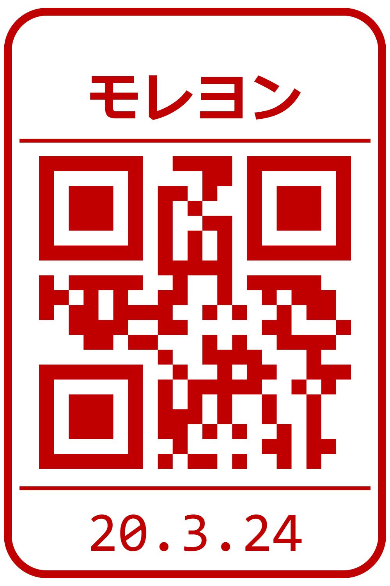

# 申請マネージャ GUI

[](https://gallery.ecr.aws/jtekt-corporation/shinsei-manager-front)

This is the GUI for [申請マネージャ (Shinsei-manager)](https://github.com/jtekt/web-based-approval-system), a web application to manage approval workflows.
The application aims at replacing ハンコ (Hanko) - personal seals used to approve paper documents in Japan - with a digital equivalent.

In this GUI, this digital equivalent proof of approval takes the form of the following virtual seal, named web hanko:

<p align="center">
  
</p>

The Web hanko embeds a QR code which contains the database ID of the given approval from the given approver, meaning that the web hanko for every approval of every user is unique.
Thus, the validity of those seals can be verified even if those are included in documents which are later exchanged in pdf format or printed out.

## Environment variables

### Services

| Variable | Description | Default |
| --- | --- | --- |
| `VITE_SHINSEI_MANAGER_URL` | Base URL of the Shinsei-manager API | `http://localhost:8000` |
| `VITE_GROUP_MANAGER_API_URL` | Base URL of the group manager API (required) |  |
| `VITE_EMPLOYEE_MANAGER_API_URL` | Base URL of the user manager API (required) |  |
| `VITE_EMPLOYEE_MANAGER_FRONT_URL` | URL of the user manager GUI, linked from user chips and web hankos (required) |  |

### Authentication

Both OIDC and username/password login can be configured at the same time; the login page then offers both.

| Variable | Description |
| --- | --- |
| `VITE_OIDC_AUTHORITY` | OIDC provider issuer URL (e.g. `https://keycloak.jtektrnd.net/realms/jtekt`) |
| `VITE_OIDC_CLIENT_ID` | Client ID registered in the OIDC provider |
| `VITE_LEGACY_LOGIN_URL` | User manager endpoint for username/password login (e.g. `…/v3/auth/login`) |
| `VITE_LEGACY_PASSWORD_RESET_URL` | URL of the password reset page offered on the login page |
| `VITE_LEGACY_IDENTIFICATION_URL` | Endpoint called after login to fetch the full user profile (e.g. `…/v3/users/self`) |
| `VITE_AUTH_ENRICHMENT_ID_FIELD` | User field used to look the user up in that endpoint (e.g. `_id`) |

### Display

| Variable | Description | Default |
| --- | --- | --- |
| `VITE_APP_TITLE` | Title shown in the app bar and browser tab | 申請マネージャー |
| `VITE_PDF_ONLY` | When `true`, the app only handles PDF applications (used by the `pdf-*` overlays) | false |

### Common

These variables are shared by all the corporate-apps GUIs.

| Variable | Description |
| --- | --- |
| `VITE_I18N_LOCALE` | Default UI language (`ja` or `en`), used until the user picks one |
| `VITE_I18N_FALLBACK_LOCALE` | Language used for missing translations |
| `VITE_APPS_URL` | URL of the apps portal; shows an apps button in the app bar when set |
| `VITE_HELP_URL` | URL of the help page; shows a help button in the app bar when set |

## Runtime configuration

The variables above are read at runtime, not baked into the build: at container startup, `40-env-config.sh` writes every `VITE_*` environment variable to `/env.js`, which `src/runtimeEnv.ts` merges over the build-time values. The same image can therefore be configured per deployment through the Kubernetes manifest. This app is deployed with kustomize: `kustomize/overlays` holds the production, staging and PDF-only variants.

In development, values come from `.env` (i18n defaults) and `.env.development` (local URLs).

The version shown on the About page is the git tag, passed at build time (`--build-arg APP_VERSION`); it cannot be changed at runtime.

## Development

```
npm install
npm run dev
```

`npm run build` type-checks and builds for production.
